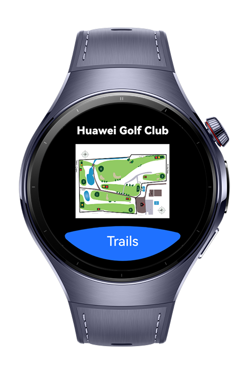
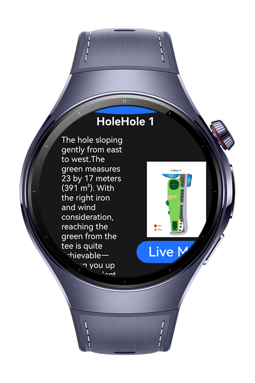
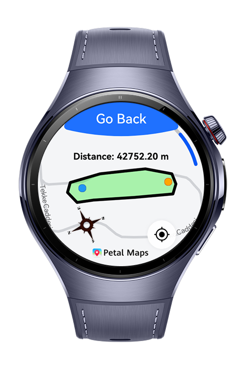

> **Note:** To access all shared projects, get information about environment setup, and view other guides, please visit [Explore-In-HMOS-Wearable Index](https://github.com/Explore-In-HMOS-Wearable/hmos-index).

# Golf Helper

A modern golf assistant that helps you navigate the course with ease. See hole layouts, track distances, and use the compass to perfect your aim.

# Preview

<p align="left">
    
    
    
    
</p>


# Use Cases
- The user views the full golf course map to plan strategy and understand hole positions.
- The user measures the distance between their current location and any point on the course (e.g., to the green or hazard).
- The app uses the compass to help the user align shots accurately with the target direction.

# Technology 
## Stack 

**Languages**: ArkTS, ArkUI  
**Frameworks**: HarmonyOS SDK 5.1.0  
**Tools**: DevEco Studio Version 5.1.0.828
**Libraries/Kits**:
- @kit.ArkUI
- @kit.MapKit
- @kit.BasicServicesKit
- @kit.LocationKit
- @kit.SensorServiceKit

## Required Permissions

- `ohos.permission.LOCATION` – for accessing precise location data.
- `ohos.permission.APPROXIMATELY_LOCATION` – for accessing approximate location information when precise location is not needed.


# Directory Structure

```
├───ets
│   ├───components
│   │       TrailListComponent.ets
│   │
│   ├───entryability
│   │       EntryAbility.ets
│   │
│   ├───entrybackupability
│   │       EntryBackupAbility.ets
│   │
│   ├───models
│   │       HoleModel.ets
│   │
│   ├───pages
│   │       HoleDetail.ets
│   │       Index.ets
│   │       MapPage.ets
│   │       TrailList.ets
│   │
│   └───utils
│           PermissionsUtil.ets
│
└───resources
    ├───base
    │   ├───element
    │   │       color.json
    │   │       float.json
    │   │       string.json
    │   └───profile
    │           backup_config.json
    │           main_pages.json
    │           router_map.json
    │
    ├───dark
    │   └───element
    │           color.json
    │
    └───rawfile

```

# Constraints and Restrictions

## Supported Device

* Huawei Watch 5

# License

**Golf Helper** is distributed under the terms of the **MIT License**.  
See the [LICENSE](LICENSE) file for more information.  